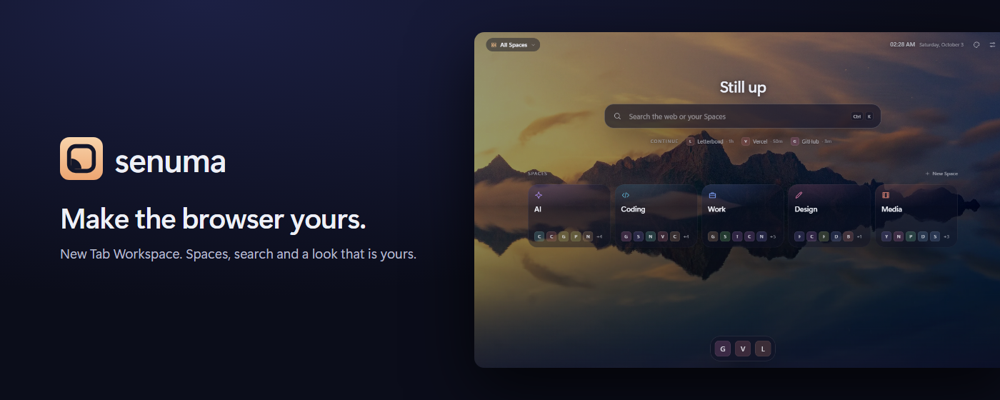
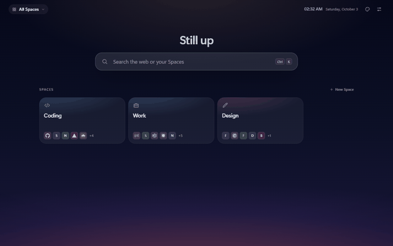
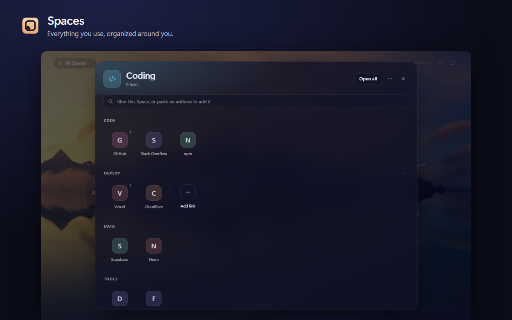
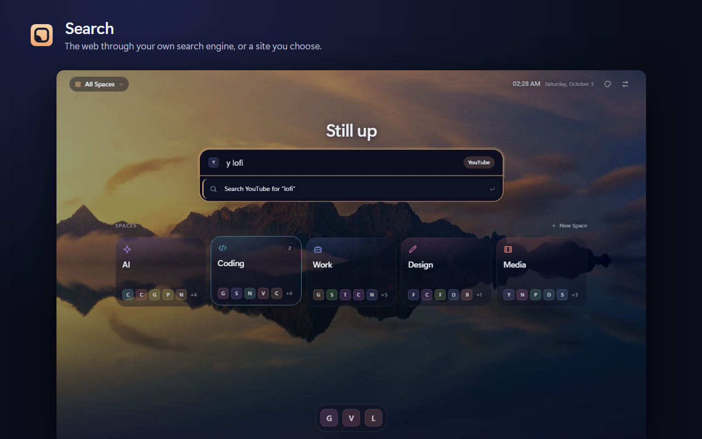
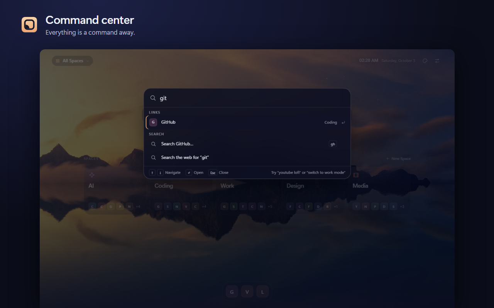
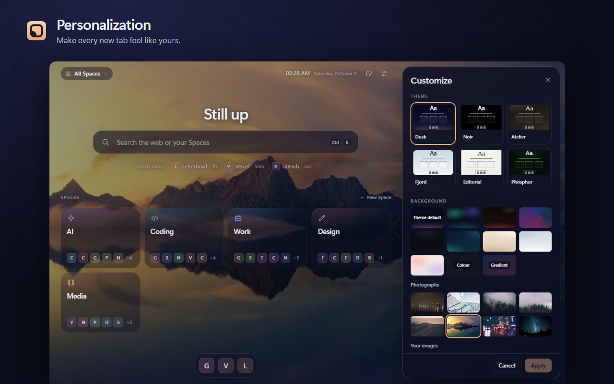

<div align="center">

# Senuma

**Make the browser yours.**

A personal workspace on every new tab.

[Chrome Web Store](https://chromewebstore.google.com/detail/oghlifenjhpbebcdeboejbmemelkfobe) · [User Guide](docs/guide/en.md) · [Kullanım Kılavuzu](docs/guide/tr.md) · [Privacy](https://methefor.github.io/Senuma/privacy.html) · [Feedback](#feedback)

</div>



Senuma is a Chrome extension that turns every new tab into your own workspace: the sites you use
organized into Spaces, one search bar with your shortcuts, Modes for each part of your day, and a
look that is yours. It is free and has no account.

> **Install.** Senuma 2.0.0 is in Chrome Web Store review. Until it is approved, the
> [store listing](https://chromewebstore.google.com/detail/oghlifenjhpbebcdeboejbmemelkfobe) still
> serves the previous version (New Tab Folders); the update arrives there, on the same listing.
> To try the current code now, [build it yourself](#build-it-yourself).

## What it does

- **Spaces**: the sites you use, grouped by what you use them for. Start from a ready-made set and
  add only the suggestions you want.
- **Search**: one bar for the web and your own links. Shortcuts such as `y lofi mix` (YouTube),
  `gh`, `w`, `r`, and any site you add with its own search address.
- **Command center**: Ctrl+K (⌘K) opens links and Spaces, switches Mode, changes theme.
- **Modes**: one key changes the whole page: its Spaces and, if you like, its look, search engine
  and dock.
- **Your look**: six themes, built-in photographs or your own image, with fit, position, dim,
  blur and atmosphere.
- **Backup**: your setup in one JSON file, with restore points.
- **English and Turkish**, interface and guide.

<div align="center">
  
</div>

<p align="center"><sub>Real Senuma interface with demonstration data.</sub></p>

<table>
  <tr>
    <td width="50%">
      
      <br><strong>Spaces</strong><br>
      Everything you use, organized.
    </td>
    <td width="50%">
      
      <br><strong>Search</strong><br>
      One search bar. Your rules.
    </td>
  </tr>
  <tr>
    <td width="50%">
      
      <br><strong>Command center</strong><br>
      Everything, one shortcut away.
    </td>
    <td width="50%">
      
      <br><strong>Your look</strong><br>
      Make every new tab feel like yours.
    </td>
  </tr>
</table>

## Privacy facts

- Free. No Senuma account. No analytics.
- Your Spaces, links and settings are stored in your browser. This release needs no Senuma cloud.
- What does go out: your searches, to the search engine you choose; icon requests, to the sites
  you saved (or to Google's icon service if you select it, or none at all with “Letters only”).
- Required permissions: `storage`, `search`. Optional, asked only when you use the feature:
  `bookmarks` (import, read once), `tabs` and `sessions` (recently closed tabs).
- No content scripts, no host permissions, no remote code.

Details: [privacy facts](docs/PRIVACY_FACTS.md) · [privacy policy](https://methefor.github.io/Senuma/privacy.html).

## Guide and help

- [User Guide (English)](docs/guide/en.md) · [Kullanım Kılavuzu (Türkçe)](docs/guide/tr.md)
- From 2.0.2 the same guide is inside the extension: **Settings → Help & Feedback**, with
  “learn more” links where questions come up.

## Feedback

Report a problem, suggest an idea or share feedback:

- in the extension (from 2.0.2): **Settings → Help & Feedback**, which prepares an email you read
  and send yourself;
- or write to **rumeliskelesi+senuma@gmail.com**.

Senuma collects nothing automatically; a report contains only what you write and, if you leave the
box ticked, four lines you can see first (Senuma version, browser, operating system, language).

## Status

| Version | State |
|---|---|
| 2.0.0 | submitted; in Chrome Web Store review |
| 2.0.2 | release candidate, frozen: Help & Feedback, the guide inside the extension |
| 2.0.3 | in preparation: small fixes (the browser tab reads “Senuma”), Turkish store listing support |

2.0.1 was an intermediate release candidate and is superseded by 2.0.2. Release record, package
hashes and test results: [docs/RELEASE_STATUS.md](docs/RELEASE_STATUS.md). Update notes:
[docs/STORE_LISTING.md](docs/STORE_LISTING.md).

Not in these versions: sync between computers (use the backup file), saved tab sessions, widgets.

## Build it yourself

```bash
npm ci
npm run build
```

Then open `chrome://extensions`, turn on Developer mode, choose **Load unpacked** and select the
generated `dist/` folder (not the repository root).

```bash
npm run check      # types, lint, unit tests, build, bundle budgets
npm run test:e2e   # the built extension in a real browser
```

Release packages are reproducible: the same commit gives a byte-identical zip
([how](docs/RELEASE_STATUS.md)).

## Source and licence

**Source available, but not currently licensed as open source.** The code is published so that
anyone can see what the extension does. No licence is granted for reuse or redistribution; all
rights are reserved unless a `LICENSE` file in this repository says otherwise.

## For contributors

[Architecture](docs/ARCHITECTURE.md) · [Messaging and wording](docs/MESSAGING_SYSTEM.md) ·
[Help & Feedback design](docs/HELP_FEEDBACK_SYSTEM.md) · [Localization roadmap](docs/LOCALIZATION_ROADMAP.md) ·
[Release status](docs/RELEASE_STATUS.md)

Storage keys and the extension ID keep their original spelling on purpose: renaming them would
orphan existing users' data.
